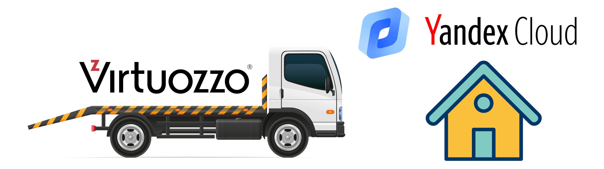
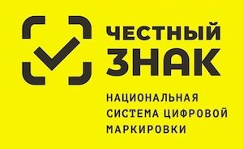
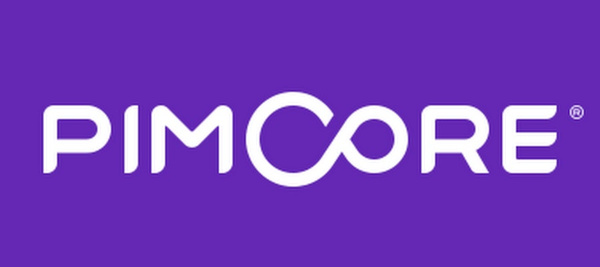

Привет! Это страничка Александра Богданова, CPO, CTO, backend-программиста, IT-инженера, тим-лида... и просто хорошего человека 🤗

Свою первую программу на BASIC-е, перепечатанную с книжки по программированию, я продал в 13 лет моему другу, и с тех под увлечение программированием меня не отпускает 😂

За 22 года мне удалось пройти путь от системного администратора небольшой локальной сети до руководителя направления интернет-продаж крупной производственной компании. За это время было реализовано множество разных проектов и накоплено множество скилов, которые помогают мне двигаться дальше и покорять российский IT. 

Настоящая моя страсть это технологии! Для меня высшее удовольствие находиться на острие современного IT, развивая себя и компании, где я работаю. 

Кстати, вы можете [нанять меня на работу 🤩](https://career.habr.com/exiper)
А по любым вопросам пишите в Телеграм: https://t.me/exiper

## 🏗️ Реализованные проекты

<strong>Переезд IT-инфраструктуры с Virtuozzo на Kubernetes на базе Яндекс.Облака</strong>

 

 
🧐 <b>Кейс:</b> В процессе развития наших e-commerce сервисов мы заметили, что всё чаще отвлекаемся на проблемы, связанные с обеспечением мониторинга, доступности и надежности работы наших сервисов. То где-то кончатся ресурсы, то ляжет целый хост-сервер с кучей виртуалок "на борту". И хотя у нас были наработки по холодной и горячей замене, а также налажен процесс восстановления из бекапов, всё-таки хотелось тратить еще меньше времени на то, чтобы заниматься любимым делом - создавать любимые сервисы. Поэтому мы начали искать более гламурное решение.   
❔ <b>Проблема:</b> Рассмотрев разные варианты (а среди них были: другое решение по виртуализации, приватное и публичное облако) мы остановились на варианте переезда в Яндекс.Облако. Причины, которые побудили нас это сделать:
<ul>
	<li>Серьезный крупный провайдер, который завтра не закроется</li>
	<li>Выполнение требования к лоализации данных</li>
	<li>По предварительным подсчетам стоимость выходила меньше (хотя здесь мы обманулись</li>
	<li>Встроенный по-умолчанию мониторинг и бекапы</li>
	<li>Решение проблем с доступностью благодаря наличию Managed Kubernetes</li>
	<li>Большое количество интересных сервисов, которые мы могли бы использовать в процессе развития наших сервисов</li>
</ul>
Выбрав решение, мы стали делать план переноса с текущей инфраструктуры в облако. По предварительным прикидкам выходило, что перенести предстояло порядка 130 сервисов, и переносить их в том виде, в каком они ранее работали (1 сервис - 1 виртуальная машина) не представляется возможным из-за очень высокой цены.   
➡️ <b>Решение:</b> Было решено сразу начать оформлять каждый из сервисов в виде docker-образа и размещать сервисы в Kubernetes. Это, в свою очередь потребовало от нас изменить подход к разработке, внедрив полноценный CI/CD, но благо на базе платформы Kubernetes сделать это оказалось очень просто.   Таким образом, в течение порядка 6 месяцев был произведен переезд внутренних корпоративных систем (WMS, CRM, CMS, PIM) в облако.   
✅ <b>Результат:</b> Уже после переноса первых сервисов на новую платформу и настройку CI/CD удалось оценить, насколько стал удобен процесс разработки и обслуживания инфраструктуры. Релизы теперь делались гораздо быстрее (часы вместо дней), а контроль над состоянием инфраструктуры стал просто тотальным. К сожалению, я ушел из компании, когда процесс переезда еще только продолжался, поэтому полностью оценить весь спектр преимуществ от переезда мне не удалось. 
    
<b>Используемый стек технологий:</b> 

<strong>Интеграция с системой Честный Знак</strong>

 

 
🧐 <b>Кейс:</b> Бизнес, в котором я работал, помимо всего прочего, продавал верхнюю одежду. С 1-го января 2021 года,  в соответствии с законодательством, такая одежда в обязательном порядке должна маркироваться специальными кодами формата DataMatrix, эмитировать которые поручено единому оператору - Центру Развития Перспективных Технологий (ЦРПТ), а сама система маркировки называется Честный Знак.   
❔ <b>Проблема:</b> Проблема заключалась в том, что данные коды являются аналогом акцизных марок для алкоголя, и учет должен производиться как на входе (при приёмке или возврате товара от покупателя), так и на выходе (при продаже или возврату поставщику). Учет должен быть стожайший, т.к., помимо штрафов, система накладывала множество ограничений на движение неучтенных кодов маркировки между организациями по линии продавец-поставщик или продавец-покупатель. Кроме этого, наличие кодов и необходимости дополнительного сканирования этого кода приёмщиками и продавцами на каждом из этапов движения товара вело к увеличению времени сборки заказов, что печалило руководство, а оно печалило нас...  Соответственно, учет этих кодов без использования какой-либо автоматизации являлся абсолютно нереалистичным. Ситуация усугублялась тем, что рынке не было приемлемых решений по маркировке товаров, т.к. сам рынок только создавался.   
➡️ <b>Решение:</b>Изучив доступные на рынке решения, мы пришли к выводу, что они нам не подходят и стали думать над собственным решением. Изучив API множества подсистем системы Честный Знак (а подсистем было много - TRUE API, API ГИС МТ, СУЗ API и ряд других), они показались нам достаточно зрелыми и юзабельными (что не часто для API гос. компаний), и мы решили сделать собственное решение, автоматизирующее работу с данными кодами. Были разработаны:
<ul>
	<li> PHP-библиотека (https://github.com/kilylabs/true-api-cli) для взаимодействием с API Честный Знак</li>
	<li>Интеграция между нашей складской WMS-системой и Честный Знак</li>
	<li>Закуплено оборудование для печати маркировки</li>
</ul> 
✅ <b>Результат:</b> Разработка заняла порядка 2-х месяцев, по итогам которой нам удалось практически полностью автоматизировать работу с кодами маркировки (за исключением участка приёмки и пересортицы). Более того, внедрение нашего решения позволило отслеживать историю движения каждого маркируемого товара, что дало маркетологам новую порцию интересных данных для анализа (например, почему одна и та же женская куртка продавалась и возвращалась 5 раз подряд на склад). Более того, в нашем решении нам удалось избавиться от необходимости двойного сканирования штрих кодов - самого штрих-кода изделия и DataMatrix кода Честного Знака. Таким образом, все операции по работе с макировкой производились прозрачно для комплектовщиков, и не приводили к увеличению сроков сборки заказов. 
  
<b>Используемый стек технологий:</b> 

<strong>Разработка и внедрение PIM (Product Information Management) системы</strong>

 

 
🧐 <b>Кейс:</b> Бизнес, в котором я работал, одной из первоочередных задач ставил качество контента, размещенного на сайтах (карточки товаров) и в печатных материалах. Однако, когда речь идет об одежде (а именно она составляла наибольший портфель заказов в компании), которая очень вариативна по своей природе (одной модели может соответствовать множество вариаций цветов, и размеров), и были определенные сложности с тем, чтобы обеспечивать должное качество и заполненность карточек товаров.  
❔ <b>Проблема:</b> Стандартные техники работы с контентом, такие как хранение всё на каком-нибудь корпоративном файл-сервере и ведение карточек в Excel-е были очень не удобны (большая вероятность ошибиться), и нам было поручено найти  подходящее решение. Первым делом, изучив проблему, для более гибкого управления контентом было решено попробовать использовать систему класса PIM (Product Information Management). Изучали 2 системы - Akeneo и PIMcore. Выбор пал на них по очень простым причинам - они OSS (хотя и имели Enterprise версии), и обе имели развитые возможности по работе с одеждой. Проведя исследования этих систем, как часто это бывает с OSS системами, качество оставляло желать лучшего.   
➡️ <b>Решение:</b> Отправив несколько багрепортов и даже пару пул-реквестов, и получив стандартную отписку, мол, покупайте Enterprise версию и будет вам счастье, нами было решено разработать подобную систему самостоятельно. Были реализованы основные необходимые нам функции PIM-системы, в частности:
<ul>
	<li>Централизация информации о контенте</li>
	<li>Поддержка CRUD-операций для всего спектра информации о товаре (текст, характеристики, картинки, документация, связи между товарами и др.)</li>
	<li>Workflow для заполнения карточки товара</li>
	<li>KPIs по статусу заполненности карточек товара</li>
	<li>Поддержка операцией импорта, также и экспорта контента (GraphQL)</li>
</ul> 
✅ <b>Результат:</b> По результату внедрения этой системы на горизонте 6-и месяцев качество контента заметно улучшилось, что положительно сказалось на выручке компании.
    

<b>Используемый стек технологий:</b> 

<strong>WMS</strong>

TODO: найти время чтобы описать

<strong>Интеграция управленческого учета на базе 1С</strong>

TODO: найти время чтобы описать

<strong>CRM</strong>

TODO: найти время чтобы описать

<strong>CMS-система</strong>

TODO: найти время чтобы описать

<strong>Интеграция аналитики ROISTAT</strong>

TODO: найти время чтобы описать

<strong>Разработка конвергентной биллинговой системы</strong>

TODO: найти время чтобы описать

<strong>Интеграция DRM системы VERIMATRIX для шифрования потокового видео </strong>

TODO: найти время чтобы описать

<strong>Разработка middleware для управление IPTV-приставками</strong>

TODO: найти время чтобы описать

## 💼 Скилы
       

       

     

  

     

  

